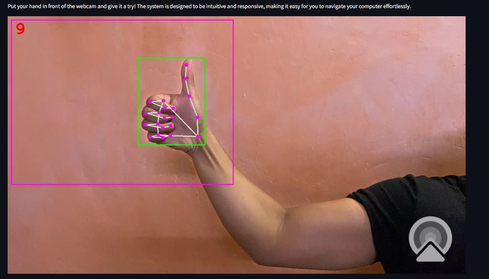

# 🎉 GestureAI: Your Hands, Your Mouse! 🎉

<div style="display: flex; justify-content: center;">
    
</div>

**The future of hands-free interaction is here!** GestureAI is a next-gen tool that turns your hand gestures into computer commands. Let your hands do the talking! ✋

### ✨ Control Your Computer Like Never Before! ✨


### 🎨 Paint Masterpieces in the Air! 🎨


- ✍️ Paint with a raised index finger
- 🎨 Choose vibrant colors by raising two fingers
- 🧽 Erase effortlessly, all with hand movements!


## About GestureAI
GestureAI is my latest project in the field of Computer Vision, developed for my Semester 5 project in my Computer Science major. GestureAI uses gesture detection to create a virtual mouse and enables you to draw in the air! This innovative project utilizes several libraries, including:
- 🤖 **MediaPipe**
- 🌐 **Requests**
- 🖼️ **OpenCV**
- 🌊 **Streamlit**
- ⏰ **Time**
- 💻 **OS**
- 🔊 **Pycaw**
- 🖱️ **Pyautogui**
- 📊 **NumPy**

The GestureAI project integrates computer vision techniques to offer hands-free interaction with computers. Users can control the mouse cursor and draw virtually in the air using simple hand gestures, all without any special hardware!

### 🚀 How GestureAI Works
GestureAI tracks hand movements in real-time using Python and OpenCV, translating them into corresponding cursor movements on the screen. It also allows users to draw virtually by waving their fingers in the air. Hand landmarks are detected, and specific gestures enable users to create artwork directly on the screen in real-time.

This technology offers a cost-effective, intuitive solution compared to traditional touch screens or stylus devices, which often require expensive hardware, pairing, and charging. You can even control your volume and scrolling!

### 🖱️ Control the Virtual Mouse Like This:
- **Move the Mouse:** Use your index finger to guide the cursor around the screen.
- **Left Click:** Tap your index and middle fingers together to simulate a left click.
- **Right Click:** Raise all five fingers for a right-click action.
- **Scroll Down:** Hold up three fingers to scroll down.
- **Scroll Up:** Hold up four fingers to scroll up.
- **Adjust Volume:** Use your index finger and thumb in a pinch motion—pinch inward to lower the volume and outward to raise it.

### 🎨 Paint Virtually Like This:
- **Paint:** Hold only your index finger up to start painting with your virtual brush.
- **Selection Mode:** Raise both your index and middle fingers to enter selection mode, where you can choose a new color or the eraser tool.

The virtual paint offers **7 vibrant colors** to choose from, allowing you to create colorful masterpieces. It took me **1 week** to create this, so please show some love! ❤️

### 👨‍🏫 Special Thanks
I took inspiration and followed the guide from [Murtaza's Workshop - Robotics and AI](https://www.youtube.com/@murtazasworkshop) and utilized his `HandTrackingModule.py`.

### 🖥️ Quick WebApp
The web app is created using Streamlit since I didn't have time to build it in Django or Flask. It's quick and user-friendly!

### 📦 Dependencies
All the dependencies are listed in `requirements.txt`. The Streamlit app is in `app.py`, and `HandTrackingModule.py` is the main backbone, which contains all the detection. The `virtualPaint_Headers` folder has all the header images for the virtual paint.

<!--
### 🐳 Docker Image
Check out the Docker image for GestureAI [here](link-to-your-docker-image).
-->

### 🤝 Connect with Me
Feel free to connect and reach out to me on [LinkedIn](https://www.linkedin.com/in/faiz-khan77/) and like this repo to show some love! 

---

## 🛠️ How to Clone and Run the App

1. **Clone the Repository:**
   Open your terminal and run the following command to clone the GestureAI repository:
   ```bash
   git clone https://github.com/faizkhan77/GestureAI.git

2. Navigate to the Project Directory:
   ```bash
   cd GestureAI

3. Install Dependencies: Make sure you have Python and pip installed. Then, run:
   ```bash
   pip install -r requirements.txt

4. Run the Streamlit App: Finally, run the following command to start the app:
   ```bash
   streamlit run app.py

Thank you for checking out GestureAI! 🚀✨


